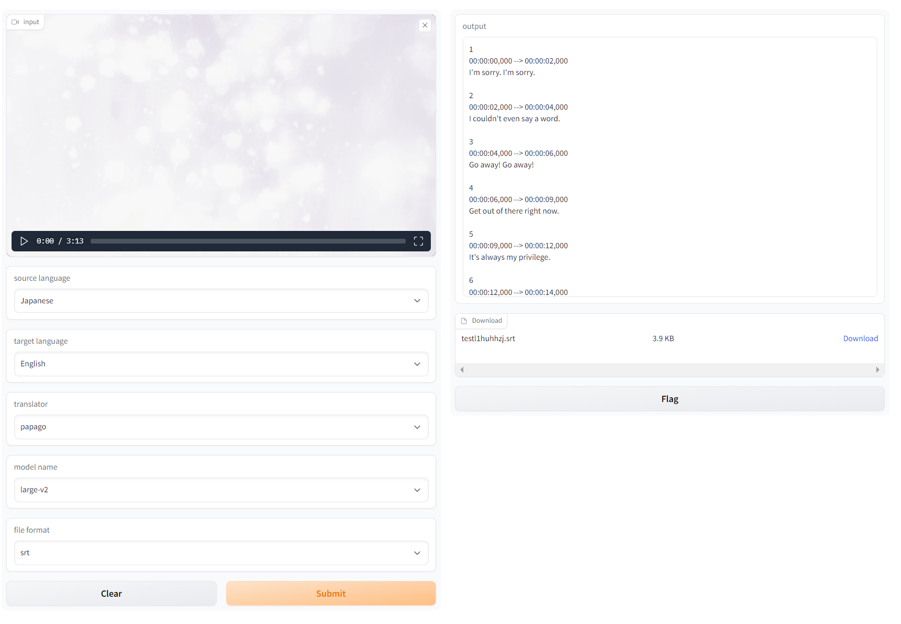

# speech translation with whisper
Subtitles generator using whisper and translator
# How does it work?
1. Through [whisper](https://github.com/openai/whisper), the sound of the video is mapped to text.
1. Translate mapped text using Translator.(ex: google translator) 
# simple demo with [gradio](https://github.com/gradio-app/gradio)

### input
1. input: The input takes a video format(ex:mp4).
1. source language:Language of input video
1. target language:Language to be translated
1. translator: Translator to use
1. model name: [whisper](https://github.com/openai/whisper) model name
1. file format: File format for output
### output
1. output: text in subtitle file
1. download: subtitle file download
# conda environment setup and run
```
conda create --name whisper python=3.8 -y
pip install torch==1.12.1+cu113 torchvision==0.13.1+cu113 torchaudio==0.12.1 --extra-index-url https://download.pytorch.org/whl/cu113
pip install -r requirements.txt

python demo.py
```
# Acknowledgments
Many thanks to these excellent opensource projects
* [Whisper](https://github.com/openai/whisper)
* [whisper code](https://github.com/qwopqwop200/whisper-and-nmt/tree/main/src) from [Whisper Webui](https://huggingface.co/spaces/aadnk/whisper-webui)
* [Silero VAD](https://github.com/snakers4/silero-vad)
* [translator code](https://github.com/qwopqwop200/whisper-and-nmt/tree/main/translators) from [manga-image-translator](https://github.com/zyddnys/manga-image-translator)
